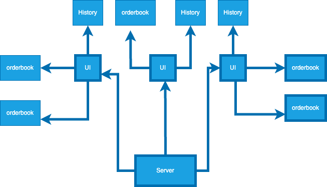
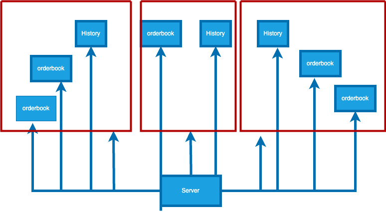

# Assignment


## Run
In the root, run dotnet run command 
```bash
dotnet run --project .\Trading.Backend\Trading.Backend.csproj  
dotnet run --project .\Trading.WPFClient\Trading.WPFClient.csproj
```

## Tool Selection
### 1. WPF
I've heard that WinForms is much easier compared to WPF. However, I chose WPF for this project. I had some brief experience with it before, and I wanted to challenge myself and revisit what I had learned. Now that I’ve completed the project, I think choosing WPF might have been a mistake — there was so much to learn: MVVM, dispatcher usage, pub/sub patterns, and more.
<br>
That said, working on the project helped me recall many things I had learned previously. It ended up being a great learning experience, and I regained a lot of confidence.

### 2. SignalR
I chose SignalR over WebSockets because of the extra features it provides. Properties like User, Group, and Caller made it easier to target specific recipients when sending messages. The built-in authentication/authorization middleware was also a valuable feature that I was able to take advantage of.

### 3. Entity Framework Core
Although the assignment forbade using a database for data retrieval, Entity Framework's in-memory database was a helpful tool for a small project like this. If I hadn’t used EF Core, I would have needed to create a single shared DB instance and register it with dependency injection as a singleton. EF Core saved me from that extra effort.

### 4. JWT
Managing connections between the server and multiple front-ends was one of my biggest concerns. A single UI instance had many concurrent connections to the server, and I needed a way to map those connection IDs to the corresponding UI.
<br>
At first, I used a Dictionary and List, but checking the connection ID with every communication was cumbersome. When I found out SignalR uses the UserIdentifier claim to identify users, I decided to switch to JWT-based identity instead. That greatly simplified my connection management. By the way, there is no login feature in this project. Client generates jwt and sends it to server.

<br>

## Design Choice
### Problem:
Should each ticker's order book connect to the server independently via SignalR, or should one centralized thread receive all order book data and distribute it to each order book instance?

### Pros of Independent SignalR Connections:
#### 1. Simpler Client Logic
Each order book manages its own connection, making the front-end code more straightforward. The client receives only the data it needs, minimizing unnecessary processing.

#### 2. Ticker-Specific Updates
The backend can efficiently push updates only to clients subscribed to specific tickers by using SignalR’s group feature.

### Cons:
#### 1. Connection Overhead
Each order book opens its own SignalR connection. If many order books are opened at once, this could lead to a large number of WebSocket connections.

#### 2. Reconnection Complexity
The front-end needs to manage reconnections for each order book independently. This adds complexity in error handling and state restoration (e.g., rejoining the correct SignalR group after disconnect).

### Conclusion
Despite the potential connection overhead, I chose to let each order book connect directly to the server. I'm not a WPF expert, and implementing inter-window communication or having a centralized message distributor in WPF would be more time-consuming and complex.
<br>
Additionally, I wanted to leverage SignalR’s group feature to manage subscriptions efficiently, since users can open as many order books as they want.

<br>




3 UI instances 3 connections  
<br>



3 UI instnaces 11 connections  


## Todo
- [ ] Pending, fulfiled status tracking
- [ ] Pagination
